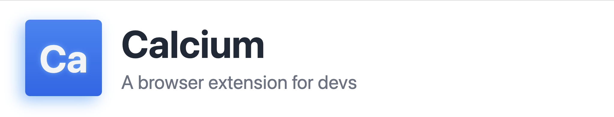
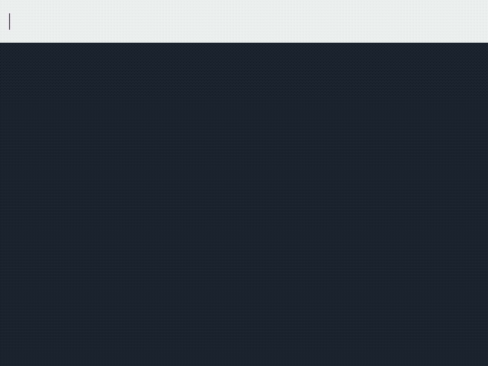

🔎 Fuzzy-find on browser tabs, bookmarks, history

🏃 Search and jump to common developer docs

Coming soon...

🤖 AI clipboard

## Installing (BETA)

Calcium is in beta and currently only supports Chrome. It is not yet published to the Chrome Web Store. If you'd still like to try it out and give your feedback, you can build and install the extension locally assuming you have a Node.js environment configured (>=LTS):

```
git clone https://github.com/ethanlynn/calcium
cd calcium/calcium-extension
npm install
npm run build
```

After building, the `dist/` directory can be installed manually in Chrome as follows:

- Navigate to `chrome://extensions`
- Ensure "Developer Mode" is toggled on in the top right corner
- Click "Load Unpacked" in the top left corner
- Select the `calcium-extension/dist/` directory
